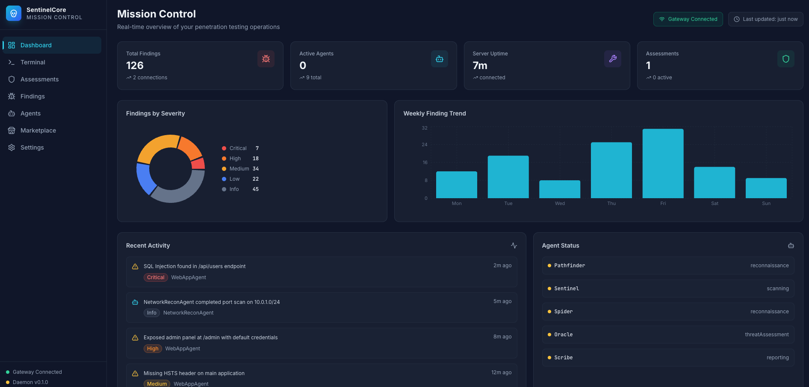
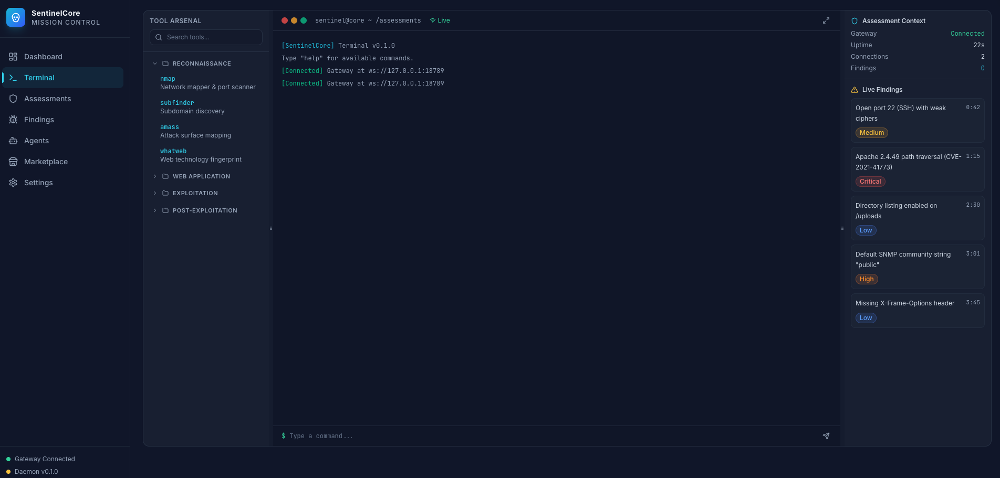
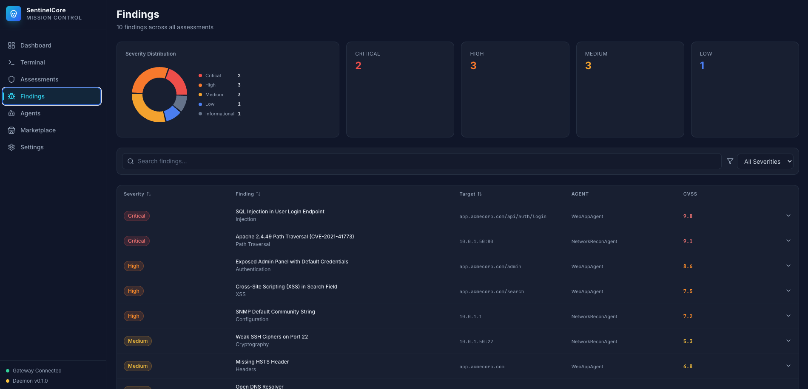
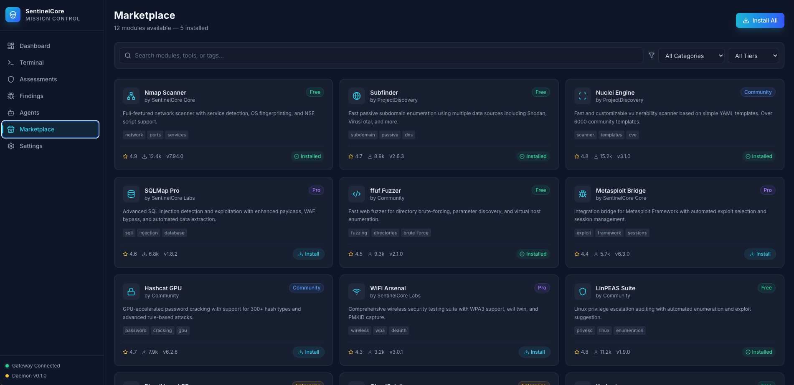

<p align="center">
  
  
  
  
</p>

<h1 align="center">SentinelCore</h1>

<p align="center">
  <strong>AI-Powered Autonomous Penetration Testing Platform</strong>
</p>

<p align="center">
  9 specialized AI agents orchestrate reconnaissance, threat assessment, vulnerability analysis,<br/>
  exploitation verification, and compliance reporting — all controlled through a real-time web dashboard and interactive terminal.
</p>

<p align="center">
  <a href="https://buymeacoffee.com/jcinc">
    
  </a>
</p>

---

## Screenshots

<p align="center">
  
  <br/><em>Mission Control — Real-time overview of findings, agent status, and assessment progress</em>
</p>

<p align="center">
  
  <br/><em>Interactive Terminal — Execute security tools with live output streaming and finding detection</em>
</p>

<p align="center">
  
  <br/><em>Agent Grid — 9 AI agents with real-time phase tracking and live activity feed</em>
</p>

<p align="center">
  
  <br/><em>Findings — Severity distribution, CVSS scoring, and detailed vulnerability list</em>
</p>

<p align="center">
  
  <br/><em>Marketplace — Browse, install, and manage assessment modules and security tools</em>
</p>

---

## Overview

SentinelCore is an AI-native penetration testing framework that automates the full assessment lifecycle. It orchestrates 9 specialized agents through a phased workflow, enforces Rules of Engagement, and streams results in real-time to a modern web dashboard.

### Key Capabilities

- **9 AI Agents** — Pathfinder, Sentinel, Spider, Oracle, Scribe, Breach, Chaos, Persist, Shield
- **Overwatch Orchestrator** — Phase-by-phase execution with 3-level kill switch (Pause / Halt / Abort)
- **Real-time Dashboard** — Live WebSocket streaming of agent output, findings, and assessment progress
- **Interactive Terminal** — Execute tools directly, run scans, and monitor results with ANSI color output
- **Multi-Provider AI** — Anthropic, OpenAI, DeepSeek, Google Gemini, or fully offline via Ollama
- **Scope Enforcement** — ROE validation before every tool execution
- **Tool Executor** — Spawns security tools with streaming output, heartbeat monitoring, and timeout management
- **Marketplace** — Browse, install, and publish assessment modules

### Agents

| Agent | Phase | Role |
|-------|-------|------|
| **Pathfinder** | Reconnaissance | Network mapping, subdomain discovery, OSINT |
| **Spider** | Scanning | Web crawling, endpoint discovery, technology fingerprinting |
| **Sentinel** | Scanning | Vulnerability detection, CVE correlation, risk scoring |
| **Oracle** | Threat Assessment | CISSP-aligned threat analysis, attack surface mapping, strategic intelligence |
| **Breach** | Exploitation | Controlled exploitation of confirmed vulnerabilities (ROE-gated) |
| **Chaos** | Exploitation | Fuzzing, input mutation, edge-case discovery |
| **Persist** | Post-Exploitation | Privilege escalation paths, lateral movement analysis (ROE-gated) |
| **Scribe** | Reporting | PDF/HTML/Markdown report generation with executive summaries |
| **Shield** | Reporting | Compliance checking against security frameworks |

### AI Providers

| Provider | Models | Use Case |
|----------|--------|----------|
| **Anthropic** | Claude Opus 4, Sonnet 4, Haiku 3.5 | Primary reasoning |
| **OpenAI** | GPT-4o, o1, o3-mini | Alternative reasoning |
| **DeepSeek** | DeepSeek-V3, DeepSeek-R1 | Code & security analysis |
| **Google** | Gemini 2.0 Flash, 1.5 Pro | Fast inference |
| **Ollama** | Llama 3.1, DeepSeek-R1, Mistral, etc. | Fully offline operation |

## Web Dashboard

The dashboard provides real-time visibility into all operations:

| Page | Description |
|------|-------------|
| **Dashboard** | Overview with severity charts, agent status, weekly trends, activity stream |
| **Assessments** | Create, start, pause, and manage penetration test assessments |
| **Agents** | Monitor 9 AI agents with live phase tracking and control |
| **Findings** | Browse all discovered vulnerabilities with severity filtering and CVSS scores |
| **Terminal** | Interactive terminal with tool execution, quick-scan, and live output |
| **Marketplace** | Browse and install security tool modules |
| **Settings** | Configure AI providers, tools, notification channels, and local models |

## Terminal Commands

```
help              Show available commands
status            Gateway connection status
agents            List registered agents
assessments       List assessments
findings          Show recent findings
run <tool> [args] Execute a tool (e.g., run nmap -sV target.com)
scan <target>     Quick-scan (nmap + nuclei)
ping              Ping the gateway
clear             Clear terminal
```

## Support the Project

If SentinelCore has been useful to you, consider supporting development:

<a href="https://buymeacoffee.com/jcinc">
  
</a>

## Disclaimer & Assumption of Risk

> **WARNING:** SentinelCore is a penetration testing and security assessment platform that interacts with computer systems and networks using automated AI agents. **By downloading, installing, or using this software, you expressly acknowledge and agree that:**
>
> - **You assume ALL risk** associated with the use of this software, including but not limited to damage to systems, data loss, service disruption, legal consequences, and any other harm.
> - **You are solely responsible** for ensuring you have proper **written authorization** before testing any target system, network, or application.
> - **You agree to hold harmless, defend, and indemnify** the authors, contributors, and affiliates from any and all claims, damages, losses, or liabilities arising from your use of the software.
> - **You are responsible** for compliance with all applicable laws and regulations in your jurisdiction, including the Computer Fraud and Abuse Act (CFAA), GDPR, and equivalent legislation.
> - The authors assume **no liability whatsoever** for actions taken by the software's AI agents, automated tools, or any component thereof.
>
> **This software is provided "AS IS" without warranty of any kind. Use at your own risk.**

## Availability

SentinelCore is currently in **closed beta**. Source code and releases will be made available to approved testers and licensed users. If you are interested in early access, contact us via [LinkedIn](https://www.linkedin.com/in/joseph-mcginty-jr/) or at [AriaOS.dev](https://ariaos.dev).

## License

This project is licensed under the [SentinelCore Non-Commercial License](LICENSE). Commercial use is strictly prohibited without a separate commercial license.

Copyright (c) 2025-2026 Joseph McGinty Jr. All Rights Reserved.

---

<p align="center">
  <a href="https://ariaos.dev">AriaOS.dev</a> &middot;
  <a href="https://resilientmindai.com">ResilientMindAI.com</a> &middot;
  <a href="https://www.linkedin.com/in/joseph-mcginty-jr/">LinkedIn</a> &middot;
  <a href="https://github.com/Subzero121800">GitHub</a>
</p>
<p align="center">
  Built by <strong>Joseph McGinty Jr</strong>
</p>
